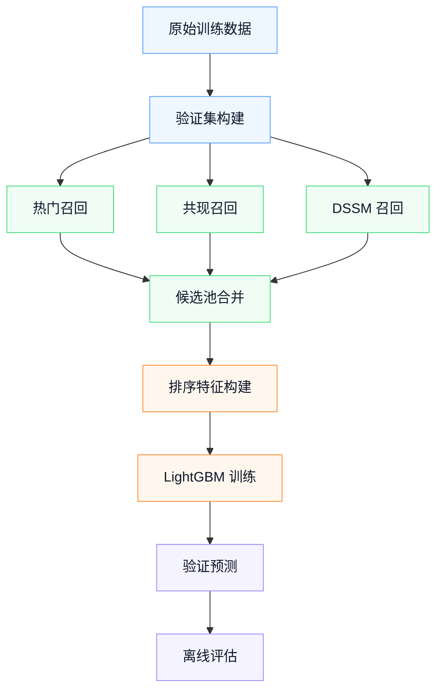
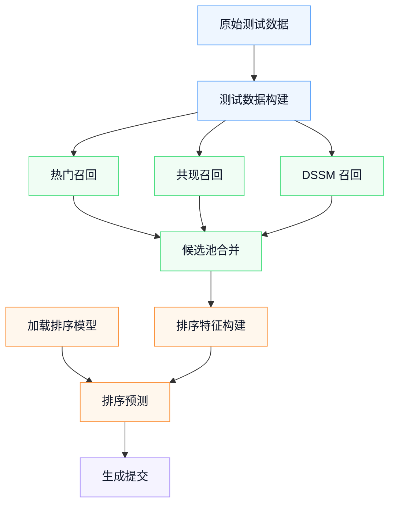

# OTTO Multi-Target Recommendation

基于 OTTO Recommender Systems 数据集构建的多目标推荐系统，目标是为每个 session 分别预测 `clicks`、`carts`、`orders` 三类行为的 Top20 item。项目实现了从多路召回、候选池构建到 LightGBM 精排和 test submission 的完整推荐链路。

数据集来源：[Kaggle OTTO Recommender System Competition](https://www.kaggle.com/competitions/otto-recommender-system)。

本项目主要用于学习和展示推荐系统完整流程。受本地算力和实验时间限制，当前实验没有使用全部数据进行训练，而是基于训练集中的 `100000` 条 session 构建离线验证，因此下方结果不代表该方法在全量数据上的最佳成绩。项目保留了 test 推理和 submission 生成流程，但最终预测结果未提交到 Kaggle 系统，重点放在打通并解释“召回 - 候选池 - 精排 - 提交”的端到端链路。

当前实验基于训练集中的 `100000` 条 session 数据，最终离线验证结果：

```text
LightGBM full validation Weighted Recall@20 = 0.3858
```

For detailed architecture, see [reports/architecture.md](reports/architecture.md).

## 1. Project Overview

OTTO 推荐任务需要根据用户 session 的历史行为，预测未来可能点击、加购和购买的商品。项目将任务统一建模为 `(session, type)` 粒度的多目标推荐：

```text
session, clicks -> Top20 item predictions
session, carts  -> Top20 item predictions
session, orders -> Top20 item predictions
```

评估指标为比赛使用的 Weighted Recall@20：

```text
clicks: 0.10
carts:  0.30
orders: 0.60
```

## 2. Experiment Setting

| Setting | Value |
|---|---|
| Data size | 100000 train sessions |
| Validation split | session 内按时间顺序 8:2 切分 |
| History window | 前 80% 作为历史行为 |
| Future labels | 后 20% 作为 validation labels |
| Single recall eval | Top20 |
| Ranker candidate pool | Top50 from covisitation and DSSM |
| LightGBM split | session-level 8:2 train/holdout split |
| Final prediction | Top20 for each `(session,type)` |

说明：

- Popular、co-visitation、DSSM 单路召回结果按 Top20 评估。
- LightGBM 排序阶段使用 Top50 候选池，让模型有更大的重排空间。
- LightGBM 训练时按 session 划分 train/holdout，避免同一个 session 同时出现在训练和验证两边。

## 3. Results

Recall baselines are evaluated with Top20 predictions:

| Method | Weighted Recall@20 |
|---|---:|
| Popular | 0.0096 |
| Covisitation | 0.2656 |
| DSSM | 0.1792 |
| Fixed Fusion | 0.3028 |

The ranker is trained on the Top50 recall candidate pool and still outputs Top20 predictions:

| Stage | Meaning | Weighted Recall@20 |
|---|---|---:|
| Candidate Oracle | Upper bound if the best Top20 items could be selected from the candidate pool | 0.4058 |
| LightGBM Holdout | Score on the 20% session-level holdout split used during ranker training | 0.3793 |
| LightGBM Full Validation | Final offline score on the full validation candidate set | 0.3858 |

## 4. Workflow

Validation / training:



Test / submission:



## 5. Method Details

### Recall

- **Popular**: 根据训练历史中的全局 item 热度生成基础召回。
- **Co-visitation**: 基于 session 内 item 共现构建 item-to-item 召回矩阵。
- **DSSM**: 训练 type-aware 双塔模型，将 session 和 item 映射到同一向量空间，通过相似度检索召回。

### Candidate Pool

召回候选池合并 popular、co-visitation 和 DSSM 三路结果，并保留：

- 各召回源的 rank 和 rank-based score。
- co-visitation / DSSM raw score 的归一化特征。
- `source_count`、`min_rank`、`rrf_score` 等多源一致性特征。

Top50 candidate oracle 为 `0.4058`，说明当前召回池仍高于最终排序结果，有继续优化排序的空间。

### Ranking

排序阶段使用 LightGBM LambdaRank：

- group 为 `(session,type)`。
- label 表示候选 aid 是否命中该目标行的未来真实 labels。
- 特征包含召回源信息、item 统计、session 统计和 session history 特征。
- 最终每个 `(session,type)` 输出 Top20。

## 6. Quick Start

查看全部 workflow 和 task。`--list` 会按 Data / Recall / Ranker / Evaluation 分组显示，并给出每个入口的示例命令：

```powershell
D:\anaconda3\envs\OTTO\python.exe src\pipeline\run.py --list
```

复现当前离线主结果：

```powershell
D:\anaconda3\envs\OTTO\python.exe src\pipeline\run.py --workflow ranker
```

从 validation 构建召回候选池并分析候选上限：

```powershell
D:\anaconda3\envs\OTTO\python.exe src\pipeline\run.py --workflow validation
```

从 validation 候选池到 LightGBM 精排完整跑一遍：

```powershell
D:\anaconda3\envs\OTTO\python.exe src\pipeline\run.py --workflow all
```

生成 test submission：

```powershell
D:\anaconda3\envs\OTTO\python.exe src\pipeline\run.py --workflow test
```

也可以单独执行某个 task，例如只评估已有预测：

```powershell
D:\anaconda3\envs\OTTO\python.exe src\pipeline\run.py evaluate --pred-file ranker_predictions.csv
```

## 7. Project Structure

```text
src/data/        validation/test data building
src/recall/      popular, co-visitation, DSSM, recall candidates
src/models/      DSSM training
src/rank/        LightGBM training and prediction
src/evaluation/  offline evaluation, candidate analysis, submission
configs/         default configuration
reports/         detailed architecture notes
```

## 8. Data And Artifacts

原始数据和实验产物不提交到 Git：

```text
data/       raw OTTO jsonl files
outputs/    parquet, csv, pkl, model artifacts
```

当前主结果依赖的关键产物包括：

- `train_events.parquet`
- `valid_labels.parquet`
- `recall_candidates.parquet`
- `ranker_train_data.parquet`
- `lgbm_ranker.txt`
- `ranker_predictions.csv`

## 9. Future Work

- 补充更多召回源，提高候选池覆盖率。
- 做更细的 ranker 特征消融和参数搜索。
- 优化全量 test 推理性能。
- 增加实验可视化报告。
