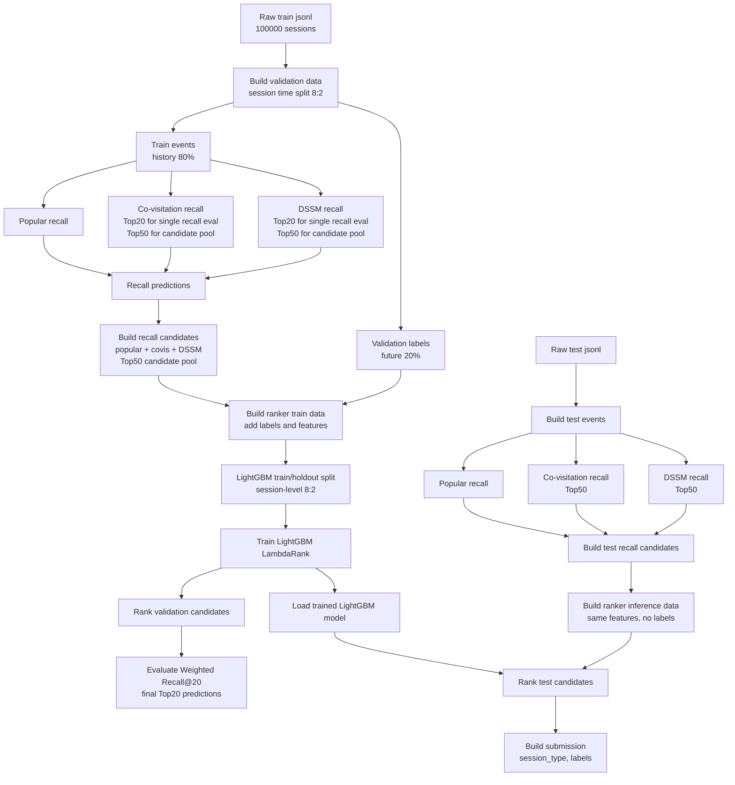

# OTTO Multi-Target Recommendation

基于 OTTO Recommender Systems 数据集构建的多目标推荐系统，目标是为每个 session 分别预测 `clicks`、`carts`、`orders` 三类行为的 Top20 item。项目实现了从多路召回、候选池构建到 LightGBM 精排和 test submission 的完整推荐链路。

当前实验基于训练集中的 `100000` 条 session 数据，最终离线验证结果：

```text
LightGBM full validation Weighted Recall@20 = 0.3858
```

For detailed architecture, see [reports/architecture.md](reports/architecture.md).

## 1. Project Overview

OTTO 推荐任务需要根据用户 session 的历史行为，预测未来可能点击、加购和购买的商品。项目将任务统一建模为 `(session, type)` 粒度的多目标推荐：

```text
session, clicks -> Top20 item predictions
session, carts  -> Top20 item predictions
session, orders -> Top20 item predictions
```

评估指标为比赛使用的 Weighted Recall@20：

```text
clicks: 0.10
carts:  0.30
orders: 0.60
```

## 2. Experiment Setting

| Setting | Value |
|---|---|
| Data size | 100000 train sessions |
| Validation split | session 内按时间顺序 8:2 切分 |
| History window | 前 80% 作为历史行为 |
| Future labels | 后 20% 作为 validation labels |
| Single recall eval | Top20 |
| Ranker candidate pool | Top50 from covisitation and DSSM |
| LightGBM split | session-level 8:2 train/holdout split |
| Final prediction | Top20 for each `(session,type)` |

说明：

- Popular、co-visitation、DSSM 单路召回结果按 Top20 评估。
- LightGBM 排序阶段使用 Top50 候选池，让模型有更大的重排空间。
- LightGBM 训练时按 session 划分 train/holdout，避免同一个 session 同时出现在训练和验证两边。

## 3. Results

| Method | Setting | Weighted Recall@20 |
|---|---|---:|
| Popular | Top20 | 0.0096 |
| Covisitation | Top20 | 0.2656 |
| DSSM | Top20 | 0.1792 |
| Fixed Fusion | Top20 | 0.3028 |
| Candidate Oracle | Top50 candidate pool | 0.4058 |
| LightGBM Holdout | Top50 pool -> Top20 | 0.3793 |
| LightGBM Full Validation | Top50 pool -> Top20 | 0.3858 |

## 4. Workflow



## 5. Method Details

### Recall

- **Popular**: 根据训练历史中的全局 item 热度生成基础召回。
- **Co-visitation**: 基于 session 内 item 共现构建 item-to-item 召回矩阵。
- **DSSM**: 训练 type-aware 双塔模型，将 session 和 item 映射到同一向量空间，通过相似度检索召回。

### Candidate Pool

召回候选池合并 popular、co-visitation 和 DSSM 三路结果，并保留：

- 各召回源的 rank 和 rank-based score。
- co-visitation / DSSM raw score 的归一化特征。
- `source_count`、`min_rank`、`rrf_score` 等多源一致性特征。

Top50 candidate oracle 为 `0.4058`，说明当前召回池仍高于最终排序结果，有继续优化排序的空间。

### Ranking

排序阶段使用 LightGBM LambdaRank：

- group 为 `(session,type)`。
- label 表示候选 aid 是否命中该目标行的未来真实 labels。
- 特征包含召回源信息、item 统计、session 统计和 session history 特征。
- 最终每个 `(session,type)` 输出 Top20。

## 6. Quick Start

查看全部 pipeline 任务：

```powershell
D:\anaconda3\envs\OTTO\python.exe src\pipeline\run.py --list
```

构建排序训练数据并训练 LightGBM：

```powershell
D:\anaconda3\envs\OTTO\python.exe src\pipeline\run.py build-ranker-train-data
D:\anaconda3\envs\OTTO\python.exe src\pipeline\run.py train-ranker
```

生成 validation 排序预测并评估：

```powershell
D:\anaconda3\envs\OTTO\python.exe src\pipeline\run.py ranker-predict
D:\anaconda3\envs\OTTO\python.exe src\pipeline\run.py evaluate --pred-file ranker_predictions.csv
```

构建 test submission。以下命令假设已经完成 test events、三路 test 召回和 test recall candidates 构建：

```powershell
D:\anaconda3\envs\OTTO\python.exe src\pipeline\run.py build-ranker-inference-data
D:\anaconda3\envs\OTTO\python.exe src\pipeline\run.py ranker-predict --candidates-file test_ranker_data.parquet --test-events-file test_events.parquet --output-file test_ranker_predictions.csv
D:\anaconda3\envs\OTTO\python.exe src\pipeline\run.py build-submission --pred-file test_ranker_predictions.csv
```

## 7. Project Structure

```text
src/data/        validation/test data building
src/recall/      popular, co-visitation, DSSM, recall candidates
src/models/      DSSM training
src/rank/        LightGBM training and prediction
src/evaluation/  offline evaluation, candidate analysis, submission
configs/         default configuration
reports/         detailed architecture notes
```

## 8. Data And Artifacts

原始数据和实验产物不提交到 Git：

```text
data/       raw OTTO jsonl files
outputs/    parquet, csv, pkl, model artifacts
```

当前主结果依赖的关键产物包括：

- `train_events.parquet`
- `valid_labels.parquet`
- `recall_candidates.parquet`
- `ranker_train_data.parquet`
- `lgbm_ranker.txt`
- `ranker_predictions.csv`

## 9. Future Work

- 接入 TIGER 或其他生成式召回，作为第四路候选源。
- 做更细的 ranker 特征消融和参数搜索。
- 优化全量 test 推理性能。
- 增加实验可视化报告。
