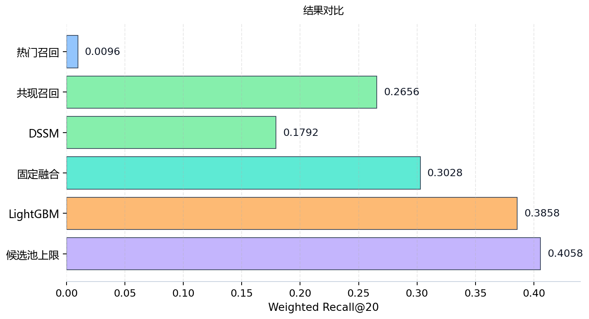
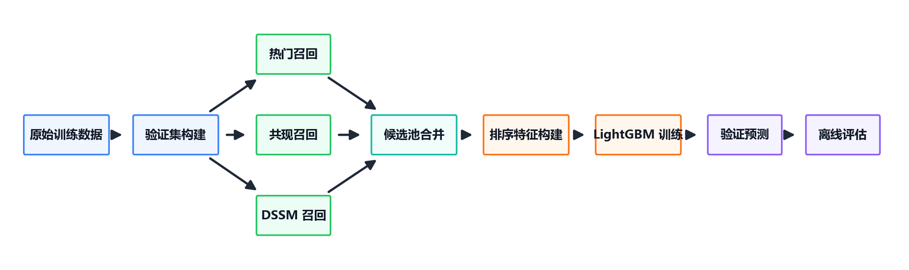
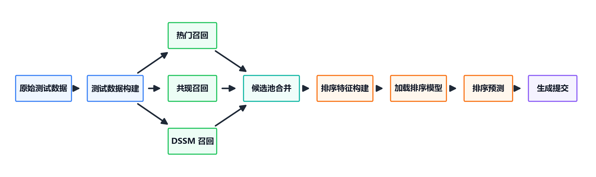

# OTTO Multi-Target Recommendation

基于 [Kaggle OTTO Recommender System Competition](https://www.kaggle.com/competitions/otto-recommender-system) 数据集构建的多目标推荐系统，目标是为每个 session 分别预测 `clicks`、`carts`、`orders` 三类行为的 Top20 item。

本项目主要用于学习和展示推荐系统完整流程。受本地算力和实验时间限制，当前实验没有使用全部数据训练，而是基于训练集中的 `100000` 条 session 构建离线验证，因此结果不代表该方法在全量数据上的最佳成绩。项目保留了 test 推理和 submission 生成流程，但最终预测结果未提交到 Kaggle 系统，重点放在打通并解释“召回 - 候选池 - 精排 - 提交”的端到端链路。

当前离线主结果：

```text
LightGBM full validation Weighted Recall@20 = 0.3858
```

详细架构说明见 [reports/architecture.md](reports/architecture.md)。

## 1. 项目概览

OTTO 推荐任务需要根据用户 session 的历史行为，预测未来可能点击、加购和购买的商品。本项目将任务统一建模为 `(session, type)` 粒度的多目标推荐：

```text
session, clicks -> Top20 item predictions
session, carts  -> Top20 item predictions
session, orders -> Top20 item predictions
```

离线评估指标为比赛使用的 Weighted Recall@20：

```text
clicks: 0.10
carts:  0.30
orders: 0.60
```

## 2. 实验设置

| 设置项 | 说明 |
| :--- | :--- |
| 数据规模 | 使用训练集中的 `100000` 条 session |
| 验证集划分 | 每个 session 内按时间顺序 `8:2` 切分 |
| 训练历史 | 前 `80%` 行为作为历史事件 |
| 验证标签 | 后 `20%` 行为作为未来标签 |
| 单路召回评估 | Popular、Co-visitation、DSSM 均按 Top20 评估 |
| 排序候选池 | Co-visitation 和 DSSM 使用 Top50 召回结果构建候选池 |
| LightGBM 划分 | 按 session 做 `8:2` train/holdout 划分 |
| 最终预测 | 每个 `(session,type)` 输出 Top20 item |

## 3. 实验结果

召回与固定融合基线：

| 方法 | 设置 | Weighted Recall@20 |
| :--- | :--- | ---: |
| 热门召回 | Top20 单路召回 | 0.0096 |
| 共现召回 | Top20 单路召回 | 0.2656 |
| DSSM 召回 | Top20 单路召回 | 0.1792 |
| 固定权重融合 | Popular + Co-visitation + DSSM，输出 Top20 | 0.3028 |

排序阶段结果：

| 阶段 | 含义 | Weighted Recall@20 |
| :--- | :--- | ---: |
| 候选池上限 | 在 Top50 候选池中理想选择 Top20 时的召回上限 | 0.4058 |
| LightGBM holdout | LightGBM 训练时按 session 划出的内部验证集结果 | 0.3793 |
| LightGBM full validation | 在完整 validation 候选集上预测后的最终离线结果 | 0.3858 |

<p align="center">
  
</p>

## 4. 工作流程

Validation / training:

<p align="center">
  
</p>

Test / submission:

<p align="center">
  
</p>

## 5. 方法说明

### Recall

- **Popular**: 按 `clicks / carts / orders` 分别统计热门 item，作为短 session 和冷启动兜底召回。
- **Co-visitation**: 基于 session 内 item 共现构建 item-to-item top-k 邻居矩阵，召回时对最近历史行为赋予更高权重。
- **DSSM**: 训练 type-aware 双塔模型，将 session 历史和 item 映射到同一向量空间，通过相似度检索召回候选。

### Candidate Pool

候选池合并 Popular、Co-visitation、DSSM 三路召回结果，并保留各召回源的 rank、rank-based score、部分 raw score 归一化特征，以及 `source_count`、`min_rank`、`rrf_score` 等多源一致性特征。

Top50 candidate oracle 为 `0.4058`，说明当前候选池上限高于最终排序结果，后续如果继续优化，主要空间在排序模型和特征。

### Ranking

排序阶段使用 LightGBM LambdaRank：

- group 为 `(session,type)`。
- label 表示候选 `aid` 是否命中该目标行的未来真实 labels。
- 特征包括召回源信息、item 统计、session 统计和 session history 特征。
- 最终每个 `(session,type)` 输出 Top20。

## 6. Quick Start

以下命令假设已经进入项目根目录，并激活了包含项目依赖的 Python 环境。

安装依赖：

```powershell
pip install -r requirements.txt
```

查看全部 workflow 和 task：

```powershell
python src\pipeline\run.py --list
```

复现当前离线主结果：

```powershell
python src\pipeline\run.py --workflow ranker
```

从 validation 构建召回候选池并分析候选上限：

```powershell
python src\pipeline\run.py --workflow validation
```

从 validation 候选池到 LightGBM 精排完整运行：

```powershell
python src\pipeline\run.py --workflow all
```

生成 test submission：

```powershell
python src\pipeline\run.py --workflow test
```

也可以单独执行某个 task，例如只评估已有预测：

```powershell
python src\pipeline\run.py evaluate --pred-file ranker_predictions.csv
```

## 7. 项目结构

```text
src/data/        validation/test data building
src/recall/      popular, co-visitation, DSSM, recall candidates
src/models/      DSSM training
src/rank/        LightGBM training and prediction
src/evaluation/  offline evaluation, candidate analysis, submission
configs/         default configuration
reports/         detailed architecture notes and figures
```

## 8. 数据与产物

原始数据和实验产物不提交到 Git：

```text
data/       raw OTTO jsonl files
outputs/    parquet, csv, pkl, model artifacts
```

当前主结果依赖的关键产物包括：

- `train_events.parquet`
- `valid_labels.parquet`
- `recall_candidates.parquet`
- `ranker_train_data.parquet`
- `lgbm_ranker.txt`
- `ranker_predictions.csv`

## 9. 后续优化

- 补充更多召回源，提高候选池覆盖率。
- 做更细的 ranker 特征消融和参数搜索。
- 优化全量 test 推理性能。
- 增加实验可视化报告。
