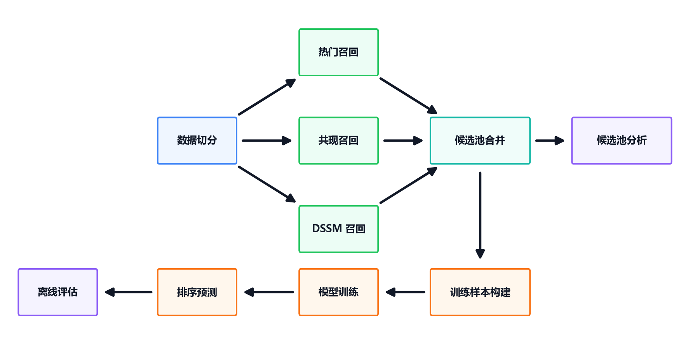
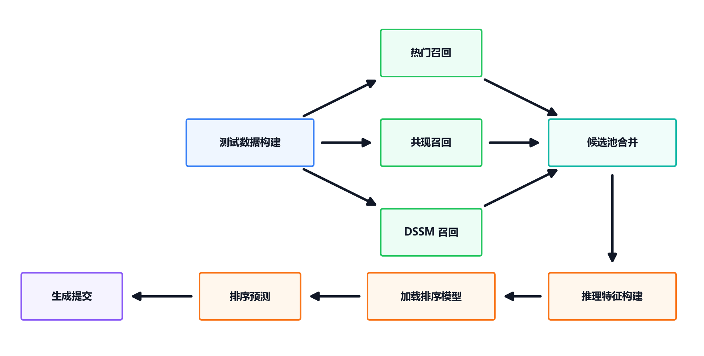

# OTTO 多目标推荐系统架构

本文档说明项目的主流程、关键输入输出格式和模块职责。项目目标是基于 OTTO 数据完成 `clicks / carts / orders` 三类目标的推荐，评估指标为加权 Recall@20：

```text
clicks: 0.10
carts:  0.30
orders: 0.60
```

## 1. 总体架构

项目采用推荐系统中常见的两阶段结构：

```text
数据构建
  -> 多路召回
  -> 召回候选池合并
  -> LightGBM 精排
  -> 预测 / 评估 / 提交
```

召回阶段负责扩大候选覆盖率，排序阶段负责在候选池内部把更可能命中的商品排到前 20。

## 2. Validation 流程

验证集有真实未来标签，因此可以做离线评估和排序训练。

<p align="center">
  
</p>

说明：

- 召回脚本只需要历史行为和目标行，不直接依赖真实标签。
- `build_ranker_train_data.py` 会读取 `valid_labels.parquet`，给候选商品打 `label`。
- `analyze_recall_candidates.py` 不属于主训练链路，只用于观察候选池理论上限。

## 3. 三路召回与多目标处理

三路召回统一输出 `session,type,predictions`，这样后续可以直接合并为候选池。

| 召回源 | 实现方式 | 多目标处理 |
| :--- | :--- | :--- |
| Popular | 按历史行为统计热门商品，作为短 session 和冷启动兜底召回 | 按 `clicks / carts / orders` 分别统计各目标类型热门榜；不足 TopK 时用全局热门补齐 |
| Co-visitation | 统计 session 内商品两两共现，保存商品 top-k 邻居；召回时按 session 历史从近到远用 `1 / position` 加权累加邻居分数 | 共现矩阵本身不区分目标类型，同一 session 的共现候选会复用到三类目标 |
| DSSM | 训练带行为类型信息的双塔模型，将 session 历史和商品映射到同一向量空间，再用相似度检索召回 | session 编码器会注入目标类型，因此同一 session 在 `clicks / carts / orders` 下可以得到不同 DSSM 候选 |

这个设计让热门召回提供分类型兜底，共现召回提供稳定的相邻商品覆盖，DSSM 补充带目标类型信息的向量候选。

## 4. Test / Submission 流程

测试集没有真实标签，只执行推理和提交文件生成。

<p align="center">
  
</p>

测试侧不会执行评估，也不会生成 `label` 列。目标行由测试事件自动展开为：

```text
session,clicks
session,carts
session,orders
```

## 5. 关键输入输出格式

这里的“格式”指每类中间文件必须包含哪些列。只要字段名和含义保持一致，各模块就可以稳定衔接。

训练或测试事件：

```text
session, aid, ts, type
```

验证标签：

```text
session, type, labels
```

召回和排序预测：

```text
session, type, predictions
```

Kaggle submission：

```text
session_type, labels
```

## 6. Pipeline 入口

所有脚本都通过 `src/pipeline/run.py` 统一执行。以下命令假设已经进入项目根目录，并激活了包含项目依赖的 Python 环境。

推荐优先使用 workflow：

```powershell
python src\pipeline\run.py --workflow validation
python src\pipeline\run.py --workflow ranker
python src\pipeline\run.py --workflow test
python src\pipeline\run.py --workflow all
```

其中：

| 流程 | 作用 |
| :--- | :--- |
| `validation` | 构建验证集召回候选池，并分析候选池理论上限 |
| `ranker` | 构建排序训练数据、训练 LightGBM、生成验证集预测并评估 |
| `test` | 生成测试集预测和 `submission.csv` |
| `all` | 执行 `validation + ranker` |

查看所有 workflow 和 task：

```powershell
python src\pipeline\run.py --list
```

`--list` 会按数据、召回、排序、评估分组显示，并在每一项后给出示例命令。

## 7. 召回候选池字段

`build_recall_candidates.py` 合并热门召回、共现召回、DSSM 三路召回，输出一行一个候选：

```text
session, type, aid,
from_popular, popular_rank, popular_score,
from_covis, covis_rank, covis_score, covis_raw_score_norm,
from_dssm, dssm_rank, dssm_score, dssm_raw_score_norm,
source_count, min_rank, rrf_score, target_type_id
```

字段含义：

| 字段 | 含义 |
| :--- | :--- |
| `from_*` | 该候选是否来自对应召回源 |
| `*_rank` | 该候选在对应召回源中的名次 |
| `popular_score / covis_score / dssm_score` | 基于 rank 的 `1 / rank` 分数，用于 RRF 类融合特征 |
| `covis_raw_score_norm` | 共现召回原始累积分数在同一 `(session,type)` 内的归一化值 |
| `dssm_raw_score_norm` | DSSM 余弦相似度在同一 `(session,type)` 内的归一化值 |
| `source_count` | 候选被多少路召回同时命中 |
| `min_rank` | 候选在所有来源中的最好名次 |
| `rrf_score` | 倒数排名融合分数 |
| `target_type_id` | `type` 的数值编码，方便 LightGBM 使用 |

## 8. 排序训练数据字段

`build_ranker_train_data.py` 在召回候选池基础上增加监督信号和统计特征：

```text
label,
item_popularity, item_click_count, item_cart_count, item_order_count,
session_len, session_click_count, session_cart_count, session_order_count,
in_session_history, session_aid_count, aid_last_pos_from_end, aid_last_type_id
```

字段含义：

| 字段 | 含义 |
| :--- | :--- |
| `label` | 当前候选 `aid` 是否在该 `(session,type)` 的未来真实标签中 |
| `item_*` | 商品在训练历史中的全局统计 |
| `session_*` | 当前 session 的长度和行为类型计数 |
| `history_*` | 候选商品是否在当前 session 历史中出现过，以及最近一次出现的位置和类型 |

## 9. 模块职责

### 数据层

- `build_validation.py`: 从原始训练数据切分历史行为和未来标签。
- `build_test_events.py`: 读取测试集 jsonl，展开为事件表。

### 召回层

- `popular_recall.py`: 全局热门召回。
- `build_covis_matrix.py`: 构建 co-visitation top-k 矩阵。
- `covisitation_recall.py`: 根据 session 历史和共现矩阵召回。
- `train_dssm.py`: 训练带行为类型信息的 DSSM。
- `dssm_recall.py`: 用 DSSM session 向量做全库相似度检索。
- `fusion_recall.py`: 固定权重 RRF 融合，作为召回基线。
- `build_recall_candidates.py`: 合并多路召回结果，输出统一候选池。

### 排序层

- `build_ranker_train_data.py`: 为验证集候选池打标签并补充特征。
- `build_ranker_inference_data.py`: 为测试集候选池补充同样的特征，不生成标签。
- `train_ranker.py`: 训练 LightGBM LambdaRank 模型。
- `predict_ranker.py`: 对候选池打分，每个 `(session,type)` 取 Top20。

### 评估与提交

- `analyze_recall_candidates.py`: 计算候选池 oracle Recall@20。
- `evaluate.py`: 评估预测文件的 Recall@20。
- `build_submission.py`: 生成 Kaggle 提交格式。

## 10. 实验设置与结果

实验设置：

| 设置项 | 说明 |
| :--- | :--- |
| 数据规模 | 使用训练集中的 `100000` 条 session |
| 验证集划分 | 每个 session 内按时间顺序 `8:2` 切分 |
| 单路召回评估 | Top20 |
| 排序候选池 | Co-visitation 和 DSSM 使用 Top50 召回结果 |
| LightGBM 划分 | 按 session 做 `8:2` 训练集/内部验证集划分 |
| 最终预测 | 每个 `(session,type)` 输出 Top20 商品 |

实验结果：

| 阶段 | 含义 | Weighted Recall@20 |
| :--- | :--- | ---: |
| 热门召回 | Top20 单路召回 | 0.0096 |
| 共现召回 | Top20 单路召回 | 0.2656 |
| DSSM 召回 | Top20 单路召回 | 0.1792 |
| 固定权重融合 | 热门召回 + 共现召回 + DSSM，输出 Top20 | 0.3028 |
| 候选池上限 | 在 Top50 候选池中理想选择 Top20 时的召回上限 | 0.4058 |
| LightGBM 内部验证 | LightGBM 训练时按 session 划出的内部验证集结果 | 0.3793 |
| LightGBM 完整验证集 | 在完整验证集候选池上预测后的最终离线结果 | 0.3858 |

<p align="center">
  
</p>

当前主结果是 `LightGBM 完整验证集 = 0.3858`。
