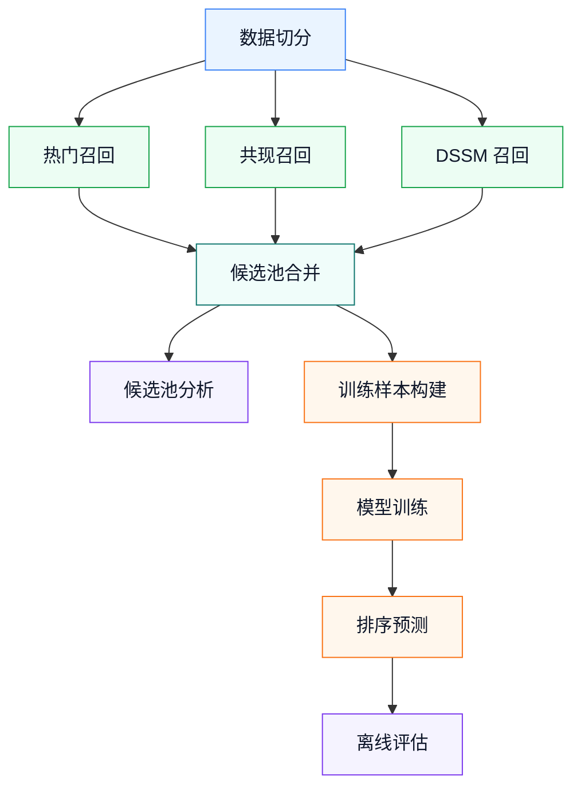
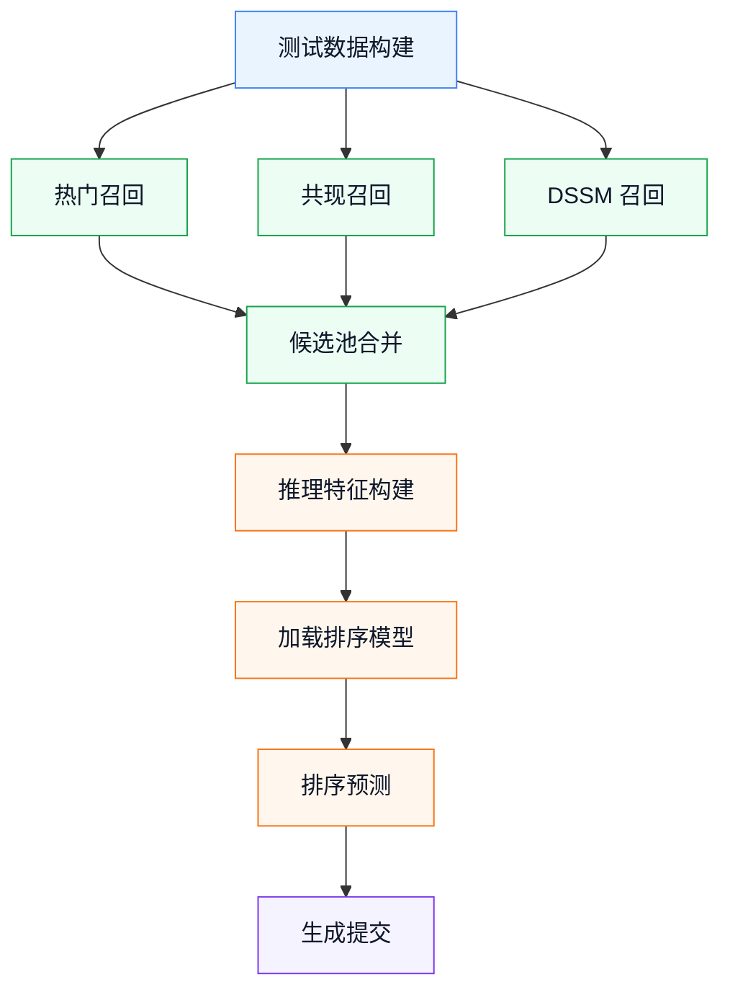

# OTTO 多目标推荐系统架构

本文档说明当前项目的主流程、关键输入输出格式和各模块职责。项目目标是基于 OTTO 数据完成 `clicks / carts / orders` 三类目标的推荐，评估指标为加权 Recall@20。

```text
clicks: 0.10
carts:  0.30
orders: 0.60
```

## 1. 总体架构

项目采用工业推荐系统里常见的两阶段结构：

```text
数据构建
  -> 多路召回
  -> 召回候选池合并
  -> LightGBM 精排
  -> 预测 / 评估 / 提交
```

召回阶段负责扩大候选覆盖率，排序阶段负责在候选池内部把更可能命中的 item 排到前 20。

## 2. Validation 流程

validation 有真实未来 label，因此可以做离线评估和排序训练。



说明：

- 召回脚本只需要历史行为和目标行，不依赖真实 label。
- `build_ranker_train_data.py` 才会读取 `valid_labels.parquet`，给候选 item 打 `label`。
- `analyze_recall_candidates.py` 不属于主训练链路，它只用于观察候选池 oracle 上限。

### 三路召回实现

当前项目的召回不是直接调用黑盒库，而是分别实现了三种互补的候选生成方式：

- 热门召回：`popular_recall.py` 按行为类型统计训练历史中的高频 item，分别为 `clicks / carts / orders` 生成热门榜。如果某个类型不足 TopK，会用全局热门 item 补齐。它主要提供稳定兜底，对短 session 更有帮助。
- 共现召回：`build_covis_matrix.py` 先按 session 时间顺序取最近一段行为，统计同一 session 内 item 两两共现次数，并为每个 item 保存 TopK 邻居；`covisitation_recall.py` 再遍历当前 session 的历史 item，越靠近当前时刻的 item 权重越高，用 `1 / position` 衰减后累加邻居共现分数，最终按分数取 TopK。
- DSSM 召回：`dssm_recall.py` 加载训练好的 DSSM 模型和 `item2id` 映射，先把全量 item embedding 归一化；推理时把 session 历史 item 和行为 type 编码成 session 向量，再结合目标 type 生成 `clicks / carts / orders` 对应的 session 表征，与全量 item embedding 做相似度检索，取 TopK 作为候选。

这三路召回的输出统一为：

```text
session, type, predictions
```

因此后续可以直接进入 `build_recall_candidates.py` 做候选池合并。

多目标处理方式：

- 热门召回是 type-specific 的：它会分别统计 `clicks / carts / orders` 的热门 item，因此三类目标的热门候选可以不同。
- 共现召回是 session-based 的：它根据当前 session 的历史 item 生成一组共现候选，再复用到该 session 的 `clicks / carts / orders` 三类目标。共现矩阵本身不区分目标 type，主要负责提供基于行为序列的候选覆盖。
- DSSM 召回是 type-aware 的：训练和推理都会使用行为 type embedding。推理时同一个 session 会结合不同目标 type 生成不同的 session 表征，因此 `clicks / carts / orders` 可以得到不同的 DSSM 候选。

这个设计让三路召回各自承担不同角色：热门召回提供分类型兜底，共现召回提供稳定的 session 相邻商品覆盖，DSSM 召回补充带目标类型信息的向量召回。

## 3. Test / Submission 流程

test 没有真实 label，只能做推理和提交文件生成。



test 侧不会执行评估，也不会生成 `label` 列。目标行由 test events 自动展开为：

```text
session,clicks
session,carts
session,orders
```

## 4. 关键输入输出格式

这里的“格式”指每类中间文件必须包含哪些列。只要字段名和含义保持一致，各模块就可以稳定衔接。

训练事件：

```text
session, aid, ts, type
```

验证标签：

```text
session, type, labels
```

召回和排序预测：

```text
session, type, predictions
```

Kaggle submission：

```text
session_type, labels
```

## 5. Pipeline 入口

所有脚本都通过 `src/pipeline/run.py` 统一执行。以下命令假设已经进入项目根目录，并激活了包含项目依赖的 Python 环境。推荐优先使用 workflow：

```powershell
python src\pipeline\run.py --workflow validation
python src\pipeline\run.py --workflow ranker
python src\pipeline\run.py --workflow test
python src\pipeline\run.py --workflow all
```

其中：

- `validation`: 构建 validation 召回候选池，并分析 candidate oracle。
- `ranker`: 构建排序训练数据、训练 LightGBM、生成 validation 预测并评估。
- `test`: 生成 test 预测和 `submission.csv`。
- `all`: 执行 `validation + ranker`。

查看所有 workflow 和 task：

```powershell
python src\pipeline\run.py --list
```

`--list` 会按 Data / Recall / Ranker / Evaluation 分组显示，并在每一项后给出示例命令。

## 6. 召回候选池字段

`build_recall_candidates.py` 合并 popular、covisitation、DSSM 三路召回，输出一行一个候选：

```text
session, type, aid,
from_popular, popular_rank, popular_score,
from_covis, covis_rank, covis_score, covis_raw_score_norm,
from_dssm, dssm_rank, dssm_score, dssm_raw_score_norm,
source_count, min_rank, rrf_score, target_type_id
```

字段含义：

- `from_*`: 该候选是否来自对应召回源。
- `*_rank`: 该候选在对应召回源中的名次。
- `popular_score / covis_score / dssm_score`: 基于 rank 的 `1 / rank` 分数，用于 RRF 类融合特征。
- `covis_raw_score_norm`: co-visitation 原始累积分数在同一个 `(session,type)` 内的归一化值，需要传入 covis detail 文件才会生成。
- `dssm_raw_score_norm`: DSSM cosine similarity 在同一个 `(session,type)` 内的归一化值，需要传入 DSSM detail 文件才会生成。
- `source_count`: 候选被多少路召回同时命中。
- `min_rank`: 候选在所有来源中的最好名次。
- `rrf_score`: reciprocal rank fusion 分数。
- `target_type_id`: `type` 的数值编码，方便 LightGBM 使用。

## 7. 排序训练数据字段

`build_ranker_train_data.py` 在召回候选池基础上增加监督信号和统计特征：

```text
label,
item_popularity, item_click_count, item_cart_count, item_order_count,
session_len, session_click_count, session_cart_count, session_order_count,
in_session_history, session_aid_count, aid_last_pos_from_end, aid_last_type_id
```

其中：

- `label`: 当前候选 `aid` 是否在该 `(session,type)` 的未来真实 labels 中。
- `item_*`: item 在训练历史中的全局统计。
- `session_*`: 当前 session 的长度和行为类型计数。
- `history_*`: 候选 item 是否在当前 session 历史中出现过，以及最近一次出现的位置和类型。

## 8. 模块职责

### 数据层

- `build_validation.py`: 从原始训练数据切分 history 和 future labels。
- `build_test_events.py`: 读取 test jsonl，展开为事件表。

### 召回层

- `popular_recall.py`: 全局热门召回。
- `build_covis_matrix.py`: 构建 co-visitation top-k 矩阵。
- `covisitation_recall.py`: 根据 session 历史和共现矩阵召回。
- `train_dssm.py`: 训练 type-aware DSSM。
- `dssm_recall.py`: 用 DSSM session 向量做全库相似度检索。
- `fusion_recall.py`: 固定权重 RRF 融合，作为召回基线。
- `build_recall_candidates.py`: 合并多路召回结果，输出统一候选池。

### 排序层

- `build_ranker_train_data.py`: 为 validation 候选池打 label 并补充特征。
- `build_ranker_inference_data.py`: 为 test 候选池补充同样的特征，不生成 label。
- `train_ranker.py`: 训练 LightGBM LambdaRank 模型。
- `predict_ranker.py`: 对候选池打分，每个 `(session,type)` 取 Top20。

### 评估与提交

- `analyze_recall_candidates.py`: 计算候选池 oracle Recall@20。
- `evaluate.py`: 评估预测文件的 Recall@20。
- `build_submission.py`: 生成 Kaggle submission 格式。

## 9. 当前结果

| 阶段 | Weighted Recall@20 |
|---|---:|
| Popular | 0.0096 |
| Covisitation | 0.2656 |
| DSSM | 0.1792 |
| Fixed fusion | 0.3028 |
| Top50 candidate oracle | 0.4058 |
| LightGBM holdout | 0.3793 |
| LightGBM full validation | 0.3858 |

当前主结果是 `LightGBM full validation = 0.3858`。
